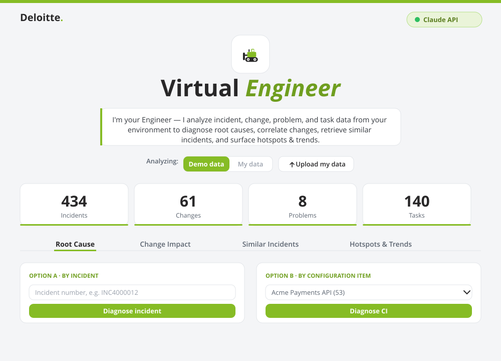

# ⚙️ Virtual Engineer

An **AI-powered incident-diagnosis copilot** that turns L2/L3 engineers into
AI-augmented experts. It correlates incidents, changes, and problems across the
ITSM estate and uses **Claude** to generate root-cause analysis, change-impact
assessment, similar-incident guidance, and portfolio hotspots — in seconds.

Built with FastAPI + Claude, on the Deloitte brand. Runs with **no API key required**
(offline heuristic) or with a key for full Claude analysis. The demo dataset is **not
bundled** — use **Bring-your-own-data** to analyse your own files, or request the demo
dataset from the maintainer.

 



---

## What it does
- 🔍 **Root Cause** — pick an incident or configuration item → correlated RCA with cited evidence and a clear conclusion.
- 🔧 **Change Impact** — flags changes followed by incident spikes on the same CI (change-induced signal).
- 📚 **Similar Incidents** — describe an issue → retrieves similar past incidents and a recommended resolution path.
- 📊 **Hotspots & Trends** — top CIs/teams/categories, SLA & reopen stats, monthly trend, AI executive summary.
- ⬆ **Bring-your-own data** — upload your own Incident/Problem/Change/Task files (CSV/Excel); auto-detected and analysed in a private, per-session dataset.

See [`docs/PROJECT_SUMMARY.md`](docs/PROJECT_SUMMARY.md) for the full write-up,
[`docs/DEMO_SCRIPT.md`](docs/DEMO_SCRIPT.md) for a recording-ready walkthrough, and
[`docs/LEADERSHIP_TALKTRACK.md`](docs/LEADERSHIP_TALKTRACK.md) for the 1-minute pitch.

---

## Run it locally

```bash
pip install -r requirements.txt
uvicorn app.main:app --reload
```
Open **http://127.0.0.1:8000**. The demo dataset isn't bundled in the repo — click **Upload my data** to analyse your own Incident/Problem/Change/Task files (CSV/Excel), or ask the maintainer for the demo data (drop it into `sample_data/`).

*(On the original Windows dev machine, `.\run.cmd` or `.\run.ps1` use the bundled
portable Python — see [CLAUDE.md](CLAUDE.md).)*

**Optional — real Claude analysis:** copy `.env.example` to `.env` and set
`ANTHROPIC_API_KEY` (or set it as an environment variable). Without it, the app
runs in offline heuristic mode.

### Tests
```bash
python -m unittest discover -s tests -t .
```

---

## Deploy a hosted demo
The app is deployment-ready (`render.yaml`, `Procfile`, `runtime.txt`) — see
[`docs/DEPLOY.md`](docs/DEPLOY.md). Note: the demo dataset isn't committed, so add it
(or wire up a data source) before hosting.

---

## Data & safety
- **`sample_data/`** — synthetic, fake demo data. **Not committed** to the public repo (git-ignored); available from the maintainer on request.
- **`data/`** — real internal data, if present, is **git-ignored** and never published.
- Secrets (`.env`) are git-ignored. Uploaded data is isolated per browser session.

---

## How it's built
- `app/main.py` — FastAPI routes · `app/diagnostics.py` — correlation + Claude reasoning ·
  `app/datasources.py` — ITSM data layer (SQLite + FTS) · `app/connectors/` — pluggable sources
  (demo CSV / live ServiceNow REST) · `app/templates` + `app/static` — Deloitte-themed UI.
- The whole project was built conversationally with **Claude Code**.
